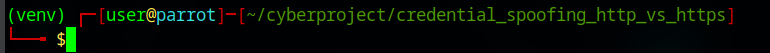
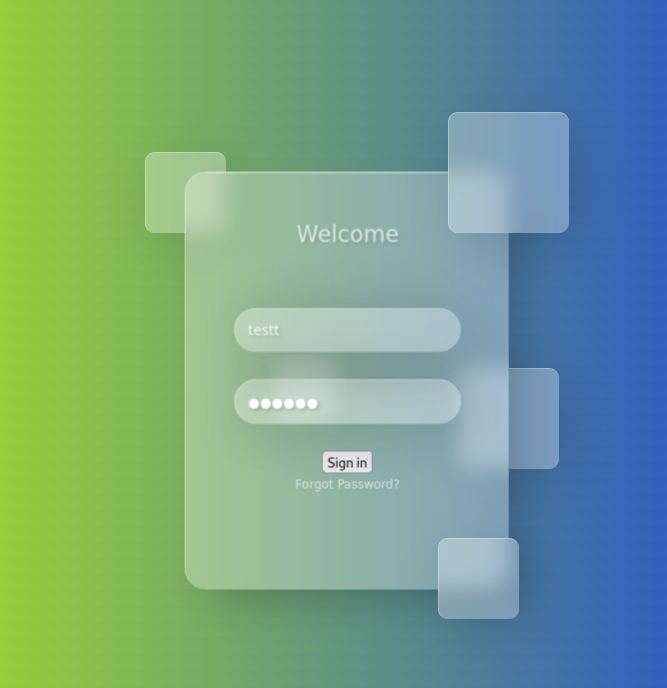
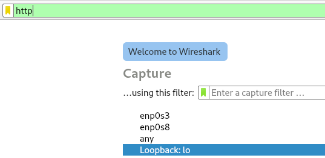
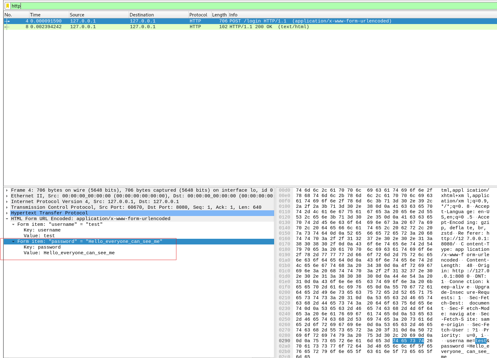

# 🧠 Credential Spoofing Lab — HTTP vs HTTPS

This guide explains step by step how to execute this entire lab from setup to analysis.

---

## 📋 Overview

This lab covers the following:

- Setting up the Python virtual environment  
- Downloading and installing the needed tools  
- Creating the HTTP and HTTPS servers  
- Generating a self-signed SSL certificate for HTTPS  
- Building the form page to capture username and password input  
- Intercepting credentials with Wireshark (HTTP vs HTTPS)  
- Explaining why HTTP can be seen in cleartext, while HTTPS cannot  
- Basic mitigation strategies  

---

## 💻 Recommended Setup

It is strongly recommended to perform this lab on a **virtual machine**.

<a href="https://parrotsec.org/" target="_blank" rel="noopener noreferrer">Parrot Security OS</a>  
<a href="https://www.oracle.com/europe/virtualization/technologies/vm/downloads/virtualbox-downloads.html" target="_blank" rel="noopener noreferrer">Oracle VirtualBox</a>

You can download the Parrot `.ova` file from the official website and import it into your hypervisor of choice.

---

## ⚙️ Step 1 — Clone the Repository

Open a terminal on your VM and run:

```bash
git clone https://github.com/spritzouuu-cyber-labs/credential_spoofing_http_vs_https
```

This command will clone the full repository from GitHub.

---

## 📂 Step 2 — Go to the Scripts Directory

Navigate to the scripts folder inside the cloned repository:

```bash
cd credential_spoofing_http_vs_https/scripts/
```

## 🐍 Step 3 — Create the Virtual Environment

Launch the virtual environment setup script:

```bash
source creation_python_venv.sh
```
We use the source command instead of ./creation_python_venv.sh so that the script runs inside the current shell (not in a subshell).
Otherwise, the activation of the virtual environment and directory change would not persist.

## 🧩 Step 4 — Verify the Setup

Once the script finishes, your terminal should look similar to this:

<figure align="center">
  
  <figcaption><i>Figure 1 — Virtual environment successfully activated in the terminal</i></figcaption>
</figure>

## ✅ Step 5 — Start the local HTTP server and test

Now that the environment and scripts are ready, start the web server and verify the login page in your browser.

### 🧭 1. Navigate to the Scripts Directory

```bash
cd ~/cyberproject/credential_spoofing_http_vs_https/scripts/
```

### ⚙️ 2. Launch the HTTP Server

```bash
python3 http_server_start.sh
```

### 🌐 3. Open the Login Page in Your Browser

```bash
firefox 127.0.0.1:8080
```

<figure align="center">
  
  <figcaption><i>Figure 2 — Login form in firefox</i></figcaption>
</figure>

You should see the login form. 

## 🧪 Step 6 — Capture the HTTP Traffic with Wireshark
This step demonstrates how credentials are transmitted in plaintext over HTTP.

### 🧩 1. Start Wireshark and Select the Loopback Interface
Filter the traffic to only capture HTTP packets:

```bash
wireshark
```
<figure align="center">
  
  <figcaption><i>Figure 3 — Wireshark setup for http</i></figcaption>
</figure>


### 🔍 2. Submit Test Credentials and Inspect the Packets
Return to the browser, enter any username/password in the form, and submit.
Then, go back to Wireshark to inspect the HTTP POST request — you’ll see the credentials in plaintext.

<figure align="center">
  
  <figcaption><i>Figure 4 — Wireshark http interception of plain credentials</i></figcaption>
</figure>

