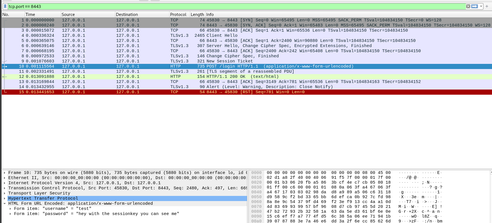

# DECRYPT_TLS.md
## Decrypt HTTPS in Wireshark using browser session keys (quick guide)

**Purpose:** short, copy-paste steps to decrypt TLS sessions in Wireshark using the browser `SSLKEYLOGFILE`.  
**Warning:** `sslkeys.log` contains sensitive secrets — treat it like a private key and delete it after use. Only use on systems you control.

---

## Overview
1. Tell the browser to write session keys to a file.  
2. Capture TLS traffic in Wireshark.  
3. Point Wireshark at the key file → Wireshark decrypts matching sessions.

---

## 1) Prepare & launch browser that writes keys

## **To do before launching you browser**

### Linux / macOS (bash)
```bash
# set the key log file path and start a fresh browser from this shell
export SSLKEYLOGFILE=/tmp/sslkeys.log
```
# Control that file is in the directoy
```bash
tail -f /tmp/sslkeys.log  
```

# make sure all browser windows are closed first, then start:
```bash
firefox https://127.0.0.1:8443
```
You should see sompthing like
```bash
CLIENT_RANDOM <client_random_hex> <master_secret_hex>
```

## 2) 🧪 Start Wireshark Capture  as mentioned in https__lab_how_to_guide.md

1. **Open Wireshark**  
   You can start it from your menu or by running:
   ```bash
   Wireshark
   ```

2. Choose the loopback interface (same as in https__lab_how_to_guide.md)


## 3) Tell Wireshark about the key file

In Wireshark: Edit → Preferences → Protocols → TLS
Set (Pre)-Master-Secret log filename to:

/tmp/sslkeys.log (Linux/macOS)

Click OK. If you already have a capture open, stop/start capture or re-open the pcap so Wireshark re-processes packets with keys.

Once you have clicked on ok you will see the credentials in plain text:

<figure align="center">
  
  <figcaption><i>Figure 1 — Wireshark decrypt with SESSIONKEY</i></figcaption>
</figure>